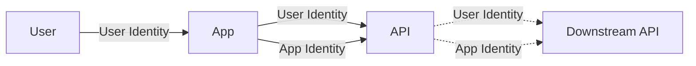
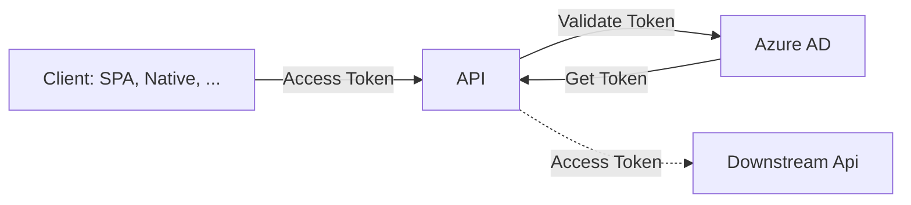
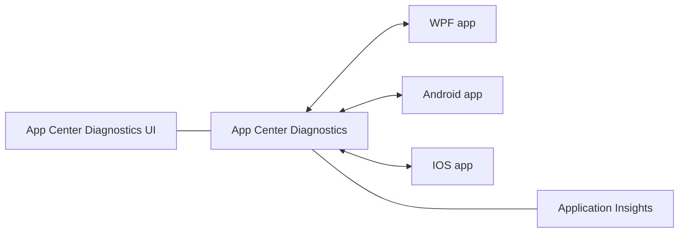
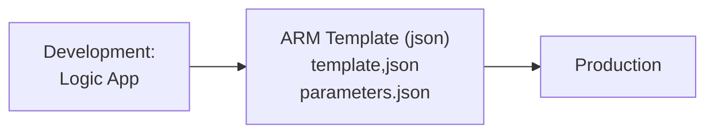
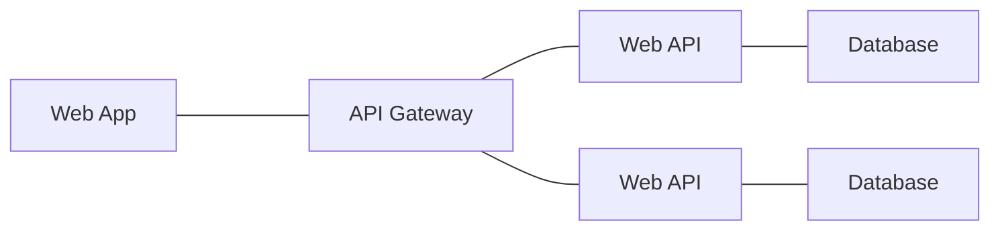
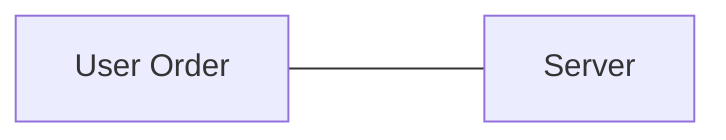
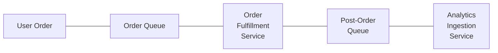
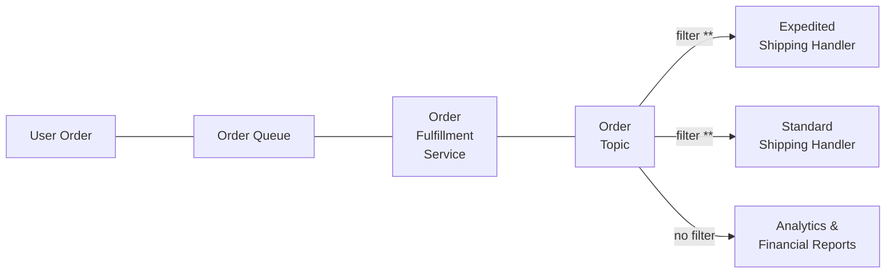

# Azure AZ-204

## Content

- [Azure AZ-204](#azure-az-204)
  - [Content](#content)
  - [Information](#information)
  - [Prerequisites](#prerequisites)
  - [AZ-204 relevant](#az-204-relevant)
  - [Study Guides](#study-guides)
  - [Service Principal vs. Managed Identities](#service-principal-vs-managed-identities)
    - [Service Principal](#service-principal)
    - [Managed Identities](#managed-identities)
  - [Use the portal to create an Azure AD application and service principal that can access resources](#use-the-portal-to-create-an-azure-ad-application-and-service-principal-that-can-access-resources)
  - [Microsoft identity platform](#microsoft-identity-platform)
  - [1. Develop Azure compute solutions (25-30%)](#1-develop-azure-compute-solutions-25-30)
    - [VM](#vm)
    - [Docker](#docker)
      - [Docker Compose](#docker-compose)
      - [Azure Directory (AD)](#azure-directory-ad)
    - [1.1 App Service Web Apps](#11-app-service-web-apps)
      - [Explore](#explore)
      - [Create Web App](#create-web-app)
      - [App Service plans (costs)](#app-service-plans-costs)
      - [App Service Environments (ASE)](#app-service-environments-ase)
      - [Deployment](#deployment)
      - [Firewall - find IP addresses](#firewall---find-ip-addresses)
      - [Exercise](#exercise)
    - [1.2 Azure Functions](#12-azure-functions)
      - [What is it](#what-is-it)
      - [Azure Function App](#azure-function-app)
      - [Hosting choices](#hosting-choices)
      - [Azure Function Trigger Types](#azure-function-trigger-types)
      - [Input and Output bindings](#input-and-output-bindings)
      - [Tools](#tools)
      - [Exercises](#exercises)
      - [Demo: create new Azure Functions project](#demo-create-new-azure-functions-project)
      - [Durable Function](#durable-function)
        - [Patterns](#patterns)
        - [Create durable functions workflow](#create-durable-functions-workflow)
        - [Sub-Orchestrations](#sub-orchestrations)
      - [Custom Handlers](#custom-handlers)
    - [1.x Exam Alert](#1x-exam-alert)
  - [2. Develop for Azure storage (15-20%)](#2-develop-for-azure-storage-15-20)
    - [2.1 Develop Solutions with Cosmos DB Storage](#21-develop-solutions-with-cosmos-db-storage)
      - [Consistency](#consistency)
      - [Container](#container)
      - [Use Primary Key (ID) as Partition Key](#use-primary-key-id-as-partition-key)
    - [2.2 Develop Solutions with Blob Storage](#22-develop-solutions-with-blob-storage)
      - [Data Redundancy (missing in the AZ-204 Book)](#data-redundancy-missing-in-the-az-204-book)
      - [Change Feed notification (missing in the AZ-204 Book)](#change-feed-notification-missing-in-the-az-204-book)
      - [Azure Storage access tiers](#azure-storage-access-tiers)
      - [Soft Delete (Storage)](#soft-delete-storage)
      - [Snapshot and Versions](#snapshot-and-versions)
      - [Lease](#lease)
      - [Immutable](#immutable)
      - [Move items in Blob Storage between Storage Accounts or containers](#move-items-in-blob-storage-between-storage-accounts-or-containers)
    - [2.x Exam Alert](#2x-exam-alert)
  - [3. Implement Azure security (20-25%)](#3-implement-azure-security-20-25)
    - [3.1 Implement User Authentication and Authorization](#31-implement-user-authentication-and-authorization)
      - [a) Management Plane: RBAC (Role Based Access Control)](#a-management-plane-rbac-role-based-access-control)
        - [RBAC: Key items](#rbac-key-items)
        - [RBAC: Role assignment](#rbac-role-assignment)
      - [b) Data Plane](#b-data-plane)
      - [c) Encryption](#c-encryption)
      - [Shared Accenture Signature (SAS)](#shared-accenture-signature-sas)
      - [Authenticate Using Azure AD](#authenticate-using-azure-ad)
        - [Identity Platform](#identity-platform)
        - [Identity](#identity)
        - [OpenID Connect](#openid-connect)
        - [App registration](#app-registration)
      - [Mutual TLS Authentication (Azure App Service)](#mutual-tls-authentication-azure-app-service)
      - [Other PluralSight trainings](#other-pluralsight-trainings)
      - [Authorization](#authorization)
    - [3.2: Implement secure cloud solutions](#32-implement-secure-cloud-solutions)
      - [Microsoft Graph](#microsoft-graph)
      - [Key Vault: Secrets](#key-vault-secrets)
        - [Option 2: User Managed Identity](#option-2-user-managed-identity)
        - [Option 3: Use Key Vault References (better than option 2)](#option-3-use-key-vault-references-better-than-option-2)
        - [Soft Delete (Key Vault)](#soft-delete-key-vault)
        - [Purge protection](#purge-protection)
      - [Key Vault: Keys](#key-vault-keys)
      - [Key Vault: Certificates](#key-vault-certificates)
    - [3.x Exam Alert](#3x-exam-alert)
  - [4. Monitor, troubleshoot, and optimize Azure solutions (15-20%)](#4-monitor-troubleshoot-and-optimize-azure-solutions-15-20)
    - [4.1 Integrate caching and content delivery](#41-integrate-caching-and-content-delivery)
      - [Configuring Cache and Expiration Policies in Azure CDN](#configuring-cache-and-expiration-policies-in-azure-cdn)
      - [Configuring Cache and Expiration Policies for Azure Redis Cache](#configuring-cache-and-expiration-policies-for-azure-redis-cache)
      - [Implementing Application Caching Pattern](#implementing-application-caching-pattern)
      - [Configuring Redis Cache *)](#configuring-redis-cache-)
    - [4.2 Instrument Solutions for Monitoring and Logging](#42-instrument-solutions-for-monitoring-and-logging)
      - [Azure Monitor](#azure-monitor)
      - [Application Insights (Part of Azure Monitor)](#application-insights-part-of-azure-monitor)
      - [Azure Application Insights Web Tests](#azure-application-insights-web-tests)
      - [Transient Faults](#transient-faults)
    - [4.x Exam Alert](#4x-exam-alert)
  - [5. Connect to and consume Azure services and third-party services (15-20%)](#5-connect-to-and-consume-azure-services-and-third-party-services-15-20)
    - [5.1 Develop an App Service Logic App](#51-develop-an-app-service-logic-app)
      - [Components](#components)
      - [Scheduled Triggers](#scheduled-triggers)
      - [Triggers](#triggers)
      - [Connectors](#connectors)
      - [Managed Connector Types](#managed-connector-types)
      - [Making Decisions](#making-decisions)
      - [Custom Connector Lifecycle](#custom-connector-lifecycle)
      - [Create Custom Template](#create-custom-template)
    - [5.2 Implement API Management](#52-implement-api-management)
      - [Introduction](#introduction)
      - [Protect APIs and Improve performance](#protect-apis-and-improve-performance)
    - [5.3 Develop Event-based Solutions](#53-develop-event-based-solutions)
      - [Event Grid](#event-grid)
      - [Event Hub](#event-hub)
      - [Notification Hub (ANH)](#notification-hub-anh)
    - [5.4 Develop Message-based Solutions](#54-develop-message-based-solutions)
      - [Azure Queue Storage](#azure-queue-storage)
      - [Azure Service Bus](#azure-service-bus)
        - [Topics](#topics)
    - [Azure Queue Storage vs. Message Bus](#azure-queue-storage-vs-message-bus)
    - [5.x Exam Alert](#5x-exam-alert)

## Information

Source: <https://app.pluralsight.com/paths/certificate/developing-solutions-for-microsoft-azure-az-204>

## Prerequisites

Omnishare? --> OmniSharp?

## AZ-204 relevant

- Have a deeper look :)
- learn all statements, but not the arguments:
  - example: `az webapp log config --name ...`

## Study Guides

- PluralSight <https://app.pluralsight.com/paths/certificate/developing-solutions-for-microsoft-azure-az-204>
- Microsoft Learn: <https://docs.microsoft.com/en-us/learn/certifications/azure-developer/>
- Check 'Download exam skills outline' from <https://docs.microsoft.com/en-us/learn/certifications/exams/az-204#certification-exams>
- <https://www.thomasmaurer.ch/2020/03/az-204-study-guide-developing-solutions-for-microsoft-azure/>  

## Service Principal vs. Managed Identities

Instead of creating a service principal, consider using managed identities for Azure resources for your application identity. If your code runs on a service that supports managed identities and accesses resources that support Azure AD authentication, managed identities are a better option for you. To learn more about managed identities for Azure resources, including which services currently support it, see What is managed identities for Azure resources?.

### Service Principal

This article shows you how to use the portal to create the service principal in the Azure portal. It focuses on a single-tenant application where the application is intended to run within only one organization. You typically use single-tenant applications for line-of-business applications that run within your organization. You can also use Azure PowerShell to create a service principal: <https://docs.microsoft.com/en-us/azure/active-directory/develop/howto-authenticate-service-principal-powershell>

### Managed Identities

<https://docs.microsoft.com/en-us/azure/active-directory/managed-identities-azure-resources/overview>

Here are some of the benefits of using managed identities:

- You don't need to manage credentials. Credentials aren’t even accessible to you.
- You can use managed identities to authenticate to any resource that supports  [Azure AD authentication](https://docs.microsoft.com/en-us/azure/active-directory/authentication/overview-authentication), including your own applications.
- Managed identities can be used without any additional cost.
- (Managed identities for Azure resources is the new name for the service formerly known as Managed Service Identity (MSI)).

User-Assigned: Service Principal behind

```cs
string userAssignedClientId = "my new guid for production"; // guid from user assigned managed identity
var uri = new Uri(containerEndpoint);
var defaultCredentialOptions = new DefaultCredentialOptions { ManagedIdentityClientId = userAssignedClientId };

// works locally AND in production (looks for a valid credential - uses current user locally)
var defaultCredential = new DefaultCredential(); 

var containerClient = new BlobContainerClient(ur, defaultCredential);
```

## Use the portal to create an Azure AD application and service principal that can access resources

> Service Principal: no explicit creation available

<https://docs.microsoft.com/en-us/azure/active-directory/develop/howto-create-service-principal-portal>

## Microsoft identity platform

Samples: <https://github.com/Azure-Samples/active-directory-aspnetcore-webapp-openidconnect-v2/>

## 1. Develop Azure compute solutions (25-30%)

### VM

### Docker

<https://docs.microsoft.com/en-us/azure/container-registry/>

Write Dockerfile: <https://docs.docker.com/develop/develop-images/dockerfile_best-practices/>

Azure Container Registry service tiers: <https://docs.microsoft.com/en-us/azure/container-registry/container-registry-skus>

Tutorial: AKS <https://docs.microsoft.com/en-us/azure/aks/tutorial-kubernetes-prepare-app>

#### Docker Compose

<https://docs.docker.com/compose/>

Docker compose vs. Kubernetes: <https://stackoverflow.com/questions/47536536/whats-the-difference-between-docker-compose-and-kubernetes>

>You can start by converting your docker-compose.yml to Kubernetes manifests with Kompose. That way you’ll be using an application and definition that you’re already familiar with instead of starting from scratch with an application you don’t know.

#### Azure Directory (AD)

Provisioning with SCIM (System for Cross-domain Identity Management) – getting started: <https://techcommunity.microsoft.com/t5/identity-standards-blog/provisioning-with-scim-getting-started/ba-p/880010>

### 1.1 App Service Web Apps

<https://docs.microsoft.com/en-us/azure/app-service/>

- http-based service for hosting
- docker or app service
- managed service
  - security
  - load balancing
  - automation
- costs: see app service plan

#### Explore

<https://docs.microsoft.com/en-us/learn/modules/introduction-to-azure-app-service/>

#### Create Web App

- choose code or docker
- Create Basic Web App: <https://docs.microsoft.com/en-us/azure/architecture/reference-architectures/app-service-web-app/basic-web-app?tabs=cli>

#### App Service plans (costs)

Image see: "Create Basic Web app"

- isolated
  - for special cases

- non-isolated
  - ok for usual cases
  - Free and Shared F1, D1
  - Basic B1 B2 B3
  - Standard S1 S2 S3
  - Premium v2 P1v2 P2v2 P3v2
  - Premium v3 P1v3 P2v3 P3v3

#### App Service Environments (ASE)

- high scale, high memory
- secure network
- fine grained control
- connect to on-premise (by vpn or express route)

#### Deployment

<https://github.com/projectkudu/kudu/wiki>

- Github
- Bitbucket
- Azure Repos
- Local Git

manual

- OneDrive
- Dropbox
- External
- FTP

Build Provider

- App Service Build service (Kudu engine)
- Github Actions
- Azure Pipelines

#### Firewall - find IP addresses

```bash
az webapp show \
    --resource-group <group_name> \
    --name <app_name> \ 
    --query outboundIpAddresses \
    --output tsv
```

```bash
az webapp show \
    --resource-group <group_name> \ 
    --name <app_name> \ 
    --query possibleOutboundIpAddresses \
    --output tsv
```

#### Exercise

<https://docs.microsoft.com/en-us/learn/modules/introduction-to-azure-app-service/7-create-html-web-app>

Create (and update) static web site

```bash
az webapp up --location "westeurope" --name "MyStaticWebSiteTest" --html
```

Check the output:

- check website
- use the resource group name to delete it:

```bash
az group delete --name <resource_group> --no-wait
```

### 1.2 Azure Functions

Source: Mark Heath: <https://app.pluralsight.com/library/courses/microsoft-azure-developer-implement-azure-functions/>

#### What is it

- A “serverless application platform”
- A simple way to run small pieces of code (“functions”) in the cloud
- A “Functions as a Service” (FaaS) platform

#### Azure Function App

One or more related Azure Functions, that are developed, deployed and hosted as a group

#### Hosting choices

Azure Functions usually run in a “Service plan” on Azure App Service

| Azure Native     | Function                                 |
| ---------------- | ---------------------------------------- |
| Consumption Plan | Serverless, Automatic scale, 5 min limit |
| App Service Plan | Traditional pricing model                |
| Premium Plan     | Speed, Security, Reserved instances      |

| Alternative Environment | Runs where                |
| ----------------------- | ------------------------- |
| Docker container        | On premises, In any cloud |
| Locally                 | Development and testing   |

#### Azure Function Trigger Types

| Type                                                       | Function                                        |
| ---------------------------------------------------------- | ----------------------------------------------- |
| HTTP Request Trigger (web hooks)                           | use for APIs and webhooks                       |
| Timer Trigger (cron jobs)                                  | use for scheduled tasks                         |
| Queue Trigger                                              | run in response to a message on a queue         |
| Cosmos DB Trigger                                          | run when a document is created or updated       |
| Blob Trigger                                               | run when a new file is uploaded to Blob Storage |
| Microsoft Graph Trigger                                    | OneDrive                                        |
| SQL, SignalR, Dapr, Kafka, RabbitMQ, SendGrid, Twilio, ... | others: see link below                          |

#### Input and Output bindings

function.json - for binding definitions

List of Bindings with code examples: <https://docs.microsoft.com/en-us/azure/azure-functions/functions-triggers-bindings?tabs=csharp#supported-bindings>

#### Tools

- Azure Functions Core Tools
- Visual Studio Code
- Azure Functions VS Code Extension
- Azure Storage Emulator
- Azure Cosmos DB Emulator

#### Exercises

<https://docs.microsoft.com/en-us/learn/modules/chain-azure-functions-data-using-bindings/>

#### Demo: create new Azure Functions project

- "CosmosDB Emulator": <https://docs.microsoft.com/en-us/azure/cosmos-db/local-emulator>
- "Local Storage Emulator": <https://docs.microsoft.com/en-us/azure/storage/common/storage-explorer-emulators>

```cmd
func init
rem select node (worker runtime) and javascript (language)
```

Open project in VS Code.

Get the "Primary Connection String" from your CosmosDB Emulator (or Azure CosmosDB)
an add CosmosDBConnection to local.settings.json:

```json
"CosmosDBConnection": "AccountEndpoint=https://localhost:8081/;AccountKey=..."
```

Add a Trigger

```cmd
func new
rem select HTTP Trigger
```

Because I have installed the "Azure Functions" extension in VS Code, you see an "A" section on the left side (or press `Shift-Alt-A`).

Open "Functions" section, click on "Initialize Project for Use with VS Code" under "Local Project"

Now right-click on the function name and "Add Binding" in fill the wizard according the expected outcome:

```json
{
  "type": "cosmosDB",
  "direction": "in",
  "name": "inputDocument",
  "databaseName": "demo",
  "collectionName": "todo",
  "connectionStringSetting": "CosmosDBConnection",
  "id": "{Query.id}",
  "partitionKey": "{Query.id}",
  "sqlQuery": ""
}
```

Change the trigger (index.js) to this:

```js
module.exports = async function (context, req, inputDocument) {
  context.log("JavaScript HTTP trigger function processed a request.");

  if (!inputDocument) {
    let message = "ToDo item " + req.query.id + " not found";
    context.log(message);

    context.res = {
      status: 404,
      body: message,
    };

    // context.bindings.outputQueueItem = message; // output binding
  } else {
    context.log("Found ToDo item, Description=" + inputDocument.desc);
    context.res = {
      // status: 200, /* Defaults to 200 */
      body: inputDocument.desc,
    };
  }
};
```

Now run the trigger: <http://localhost:7071/api/HttpTrigger?id=1>

```cmd
func start
rem expect to see the url of the trigger
```

Add Output Binding

Run Wizard again to add an output binding:

```json
{
  "type": "queue",
  "direction": "out",
  "name": "outputQueueItem",
  "queueName": "outqueue",
  "connection": "AzureWebJobsStorage"
}
```

Change the trigger (index.js): add (enable) this line:

```js
    context.bindings.outputQueueItem = message; // output binding
```

and run trigger with an unknown item: <http://localhost:7071/api/HttpTrigger?id=0>

Check "Storage Explorer": Connect to your "Local Storage Emulator": you should see the new log entry under "Queues/outqueue"

#### Durable Function

- Client "Starter" Function
  - initiate a new orchestration
  - use any trigger
- Orchestrator Function
  - defines the steps in the workflow
  - handle errors
- Activity Function
  - implements a step in the workflow
  - use any bindings

Current recommendation:

- C#
- JavaScript

##### Patterns

Function chaining

```text
<⚡1> -> ⌷ -> <⚡2> -> ⌷ -> <⚡3>
```

Fan-out Fan-in (in parallel)

```text
         ┌ ->  <⚡> <- ┐
<⚡1> -> ⌷ -> <⚡> -> ⌷ -> <⚡3>
         └ ->  <⚡> <- ┘
```

Asynchronous HTTP API's (polling long running operation)

```text
 -> <⚡> -> ⌷ -> <⚡> 
    start       do work
      └- -> ⌷   <- ┘
->  <⚡> -> ┘
   get status
```

Monitor (recurring process in a workflow)

```text
                  ┌ -> ┐
<⚡>      <->   <⚡>  |
do work           └ <- ┘
check status      poll and sleep
```

Human Interaction

```text
           ┌ ->  <⚡> process approval
<⚡>   -> 😊
request    └ -> ⌚ <⚡> escalate
approval
```

##### Create durable functions workflow

- New C# project, using `Azure Functions` project template
- Before Visual Studio 2022: add a nuget to enable durable functionality on a function app:
  - `Microsoft.Azure.WebJobs.Extensions.DurableTask`
- Project, add new item: `Azure Function`, select `Durable Functions Orchestration` template
- Creates 3 new functions:
  - orchestration function
    - example: call several activity functions
    - can return data
  - activity function
  - starter function
- Start project: check cmd to get the url to call the function:
  - `Function1_HttpStart: [GET,POST] http://localhost:7071/api/Function1_HttpStart`
- Call function in PowerShell:
  - `(Invoke-WebRequest http://localhost:7071/api/Function1_HttpStart).content`
- Check
  - debug capability
  - commandline outputs
  - return of web request
    - call URL of "statusQueryGetUri" to check status
      - check `"runtimeStatus": "Completed"`
      - `"output":["Hello Tokyo!","Hello Seattle!","Hello London!"]`

##### Sub-Orchestrations

Check: PluralSight: Azure Durable Functions Fundamentals from Mark Heath

#### Custom Handlers

For not supported platforms (Rust, GO, ...)

```txt
                                                                 .........................
                    Trigger/Input                     Request    .     Custom Handler    .
                    Binding                           Payload    .=======================.
                    Payload       .================.             .                       .
                                  .                .  -------->  .                       .
.===============.                 .                .             .        Custom         .
.               .                 .    Functions   .             .       Web Server      .
.    Trigger    .   --------->    .      Host      .             .                       .
.               .                 .                .             .                       .
.===============.                 .                .  <--------  .=======================.
                                  .================.             .     Function Code     .
                                                      Response   .........................
                                           :           Payload                            
                   Output Binding Payload  :                                              
                                           V                                              
                                                                                          
                                  .================.                                      
                                  .     Target     .                                      
                                  .================.                                      
```

- Create function app using `func init`, choose Custom language
  - check section `customHandler` and `extensionBundle` in host.json
- create Azure Function
- create a web server of your choice, listen to `api/FunctionName`
- update host.json (`defaultExecutablePath` and `enableForwardingHttpRequest`)
- test locally `func start` or publish to Azure

### 1.x Exam Alert

TODO

## 2. Develop for Azure storage (15-20%)

### 2.1 Develop Solutions with Cosmos DB Storage

<https://docs.microsoft.com/en-us/azure/cosmos-db/>

#### Consistency

<https://docs.microsoft.com/en-us/azure/cosmos-db/consistency-levels>

 | Strong                                  | Bounded staleness        | Session       | Consistent prefix            | Eventual         |
 | --------------------------------------- | ------------------------ | ------------- | ---------------------------- | ---------------- |
 | strong consistency                      |                          | best tradeoff |                              | weak consistency |
 |                                         | no more than .. seconds  |               |                              |                  |
 |                                         | no more than .. versions |               |                              |                  |
 | always reads the latest committed write |                          |               | reads data in order of write |                  |

#### Container

<https://docs.microsoft.com/en-us/azure/cosmos-db/account-databases-containers-items#azure-cosmos-containers>

#### Use Primary Key (ID) as Partition Key

<https://docs.microsoft.com/en-us/azure/cosmos-db/partitioning-overview#using-item-id-as-the-partition-key>

- Choose values which do not change:
  - bad: email, name, phone, ...
- Have a 'high cardinality'
  - “high cardinality” = “a lot of different values”
  - Primary Key in a table is 'High Cardinality'
    - 'PersonId' in a Person table is 'High Cardinality'
  - 'ContinentId' in a Person table is 'Low Cardinality'
  - 'Color' in a bag of M&M is a 'Low Cardinality'

### 2.2 Develop Solutions with Blob Storage

<https://docs.microsoft.com/en-us/azure/storage/blobs/>

ETag: Entity Tag (changes when item changes)

#### Data Redundancy (missing in the AZ-204 Book)

<https://docs.microsoft.com/en-us/azure/storage/common/storage-redundancy>

- LRS: Locally redundant storage
- ZRS: Zone-redundant storage
- GRS: Geo-redundant storage
- GZRS: Geo-zone-redundant storage

Redundancy in a secondary region:

- read-access geo-redundant storage (RA-GRS)
- read-access geo-zone-redundant storage (RA-GZRS)

Overview:

  | LRS                                                                                                                                                               | ZRS                                                                                                                                                                                                                                                | GRS/RA-GRS                                                                                | GZRS/RA-GZRS                                                                                                                                          |
  | ----------------------------------------------------------------------------------------------------------------------------------------------------------------- | -------------------------------------------------------------------------------------------------------------------------------------------------------------------------------------------------------------------------------------------------- | ----------------------------------------------------------------------------------------- | ----------------------------------------------------------------------------------------------------------------------------------------------------- |
  | LRS is the lowest-cost redundancy option and offers the least durability compared to other options. LRS protects your data against server rack and drive failures | Zone-redundant storage (ZRS) replicates your Azure Storage data synchronously across three Azure availability zones in the primary region. Each availability zone is a separate physical location with independent power, cooling, and networking. |                                                                                           |                                                                                                                                                       |
  |                                                                                                                                                                   | However, ZRS by itself may not protect your data against a regional disaster where multiple zones are permanently affected.                                                                                                                        |                                                                                           |                                                                                                                                                       |
  | Three copies within a single region                                                                                                                               | Three copies across separate availability zones within a single region                                                                                                                                                                             | Six copies total, including three in the primary region and three in the secondary region | Six copies total, including three across separate availability zones in the primary region and three locally redundant copies in the secondary region |

#### Change Feed notification (missing in the AZ-204 Book)

<https://docs.microsoft.com/en-us/azure/storage/blobs/storage-blob-change-feed?tabs=azure-portal>

<https://docs.microsoft.com/en-us/azure/storage/blobs/storage-blob-change-feed-how-to>

#### Azure Storage access tiers

Types:

- hot, cold (online)
- archive (offline)
- define type (default, all but archive) on Storage Account and/or each Blob
- rehydrating (offline -> online) can take hours
- manage lifecycle with rules

| Tier&nbsp;Type    | Description                                                                                                                                                                                                                                   |
| ----------------- | --------------------------------------------------------------------------------------------------------------------------------------------------------------------------------------------------------------------------------------------- |
| Hot&nbsp;tier     | An online tier optimized for storing data that is accessed or modified frequently. The Hot tier has the highest storage costs, but the lowest access costs.                                                                                   |
| Cool&nbsp;tier    | An online tier optimized for storing data that is infrequently accessed or modified. Data in the Cool tier should be stored for a minimum of 30 days. The Cool tier has lower storage costs and higher access costs compared to the Hot tier. |
| Archive&nbsp;tier | An offline tier optimized for storing data that is rarely accessed, and that has flexible latency requirements, on the order of hours. Data in the Archive tier should be stored for a minimum of 180 days.                                   |

<https://docs.microsoft.com/en-us/azure/storage/blobs/access-tiers-overview>

#### Soft Delete (Storage)

#### Snapshot and Versions

#### Lease

edit only with lease

#### Immutable

via Access Policy:

- Time based retention (in days) - you cannot modify blob anymore, but delete after x days
- Legal hold - you cannot modify or delete blob

#### Move items in Blob Storage between Storage Accounts or containers

### 2.x Exam Alert

TODO

## 3. Implement Azure security (20-25%)

### 3.1 Implement User Authentication and Authorization

- a) Management Plane (RBAC)
- b) Data Plane
- c) Encryption

#### a) Management Plane: RBAC (Role Based Access Control)

##### RBAC: Key items

1. Security Principals

   - User
   - A Group (of users)
   - Service Principal (for headless processes)
   - Managed Identity

2. Role (Role Definition in json, containing)

   - list of actions
   - list of dataActions
   - list of notActions
   - list of notDataActions

3. Scope (set of resources)

   - further restrict roles to set of scope (Management Group, Subscription, Resource Group, Resource)

##### RBAC: Role assignment

>Attach role definition to a security principal on a scope

Example:

- User 'x' (principal) is attached Role 'y' (Role definition) to scope 'z' (scope)
  - User 'Patrik' is attached Role 'Storage Account Contributor' to Scope 'storage account patrikStorage123'
- Multiple role assignments are additive
- Deny role assignments can block access
  - superseding others

#### b) Data Plane

- Keys (Access Keys)
- Shared Access Signatures
- Azure AD

- Storage account Access Keys (A,B for rotation)
- Root
- Rotate frequently (automatically by Azure KeyVault)

#### c) Encryption

out of scope

#### Shared Accenture Signature (SAS)

3 SAS Types:

- User Delegation SAS (preferred, most secure)
  - does not use storage account key to sign signature (use AAD credentials)
  - for blob storage only (currently)
- Service SAS
  - for 1 service
- Account SAS
  - for 1 or more services

<https://docs.microsoft.com/en-us/rest/api/storageservices/create-account-sas>

Kinds of SAS

- Ad-hoc SAS
- Services SAS (with stored access policy)
  - reused by multiple SAS
  - defined on resource container
  - permissions, validity period
  - service level SAS only
  - smaller (does not contain details)

Best practices

- use HTTPS
- when possible, use User Delegation SAS
- define stored access policy for a service specific SAS
- use near-term expiration on ad-hoc, service or account SAS
- follow least-privilege access for resources to be accessed

#### Authenticate Using Azure AD

##### Identity Platform

- Authentication Service
  - AAD Azure Active Directory
    - Azure AD Connect
    - ADFS
    - [Path-through](https://docs.microsoft.com/en-us/azure/active-directory/hybrid/how-to-connect-pta-quick-start)
- Libraries (open source)
  - MSAL (new): <https://docs.microsoft.com/en-us/azure/active-directory/develop/msal-overview>
  - ADAL (old): <https://docs.microsoft.com/en-us/azure/active-directory/azuread-dev/active-directory-authentication-libraries>
  - Microsoft.Identity.Web
  - Open ID connect
- Application Management tools
  - Gallery (Slack, Wordpress, ...) and non gallery apps (SAML, Open ID Connect)
  - Single Tenant and Multi Tenant apps (Mail apps, ...)
  - Authorization
  - Consent
  - Logs

- todo: Azure AD App Manifest
  - appRoles
  - groupMembershipClaims
  - optionalClaims
  - oauth2AllowImplicitFlow (todo: check all oauth2 attributes)
  - oauth2Permissions
  - signInAudience
  
"The definition of an application object within the Microsoft Identity platform which includes all configuration for allowed authentication and authorization integrations"

<https://docs.microsoft.com/en-us/azure/active-directory/develop/reference-app-manifest>

##### Identity

- Legacy
  - Basic
  - NTLM
  - Kerberos
    - Session granted ticket, based on a ticket granting ticket (ok for on-premise)
- Modern
  - WS-* and SAML
  - OAuth (more like delegation protocol)
  - OpenID Connect
    - most flexible

##### OpenID Connect



Flows

- SPA
  - Implicit (old)
  - PKCE (new, recommended)
- Native
  - AuthCode without secret
- Web
  - AuthCode with secret
- Daemon
  - Client Credential Flow
- Limited UI
  - Device Code Flow
- Downstream API
  - `on behalf of` - Flow
    - looks like `Client Credential Flow`
    - allows to get a token for an API on behalf of a user



Tokens

- Access Token
  - present to API
  - who you are
  - what you whish to do
  - if you are authorized to do that
  - not personal - unsecure - take care!
- ID Token
  - represents User
- Refresh Token
  - to get new Access Token

##### App registration

- free
- Account type can be changed later

Account types:

- Accounts in this organizational directory only (Default Directory only - Single tenant)
  - All user and guest accounts in your directory can use your application or API.
Use this option if your target audience is internal to your organization.
- Accounts in any organizational directory (Any Azure AD directory - Multitenant)
  - All users with a work or school account from Microsoft can use your application or API. This includes schools and businesses that use Office 365.
Use this option if your target audience is business or educational customers and to enable multitenancy.
- Accounts in any organizational directory (Any Azure AD directory - Multitenant) and personal Microsoft accounts (e.g. Skype, Xbox)
  - All users with a work or school, or personal Microsoft account can use your application or API. It includes schools and businesses that use Office 365 as well as personal accounts that are used to sign in to services like Xbox and Skype.
Use this option to target the widest set of Microsoft identities and to enable multitenancy.
- Personal Microsoft accounts only
  - Personal accounts that are used to sign in to services like Xbox and Skype.

Tools:

- Quick start
- Integration assistant: for best practices
- Branding
  - publisher consent
- Authentication
  - add platforms
- Certificate and secrets
- Token configuration
- API permissions
  - granting
    - here in Azure Portal or
    - during login time (as long as user has grant - some need admin rights)
    - check also: 'consent policy'
- Expose an API
  - scopes (definition what api can do)
- Owners
- Roles adn administrators
- Manifest (json representation)

Create App from Quick start:

- choose platform
- press "Make changes for me"
- download sample
- open appSettings.json and fix domain

Generated config examples: first line in ConfigureServices of startup.cs:

```cs
// .NET Core 5 (MSAL)
// How to create a Microsoft identity platform (Azure AD v2.0) application.
// Added: Allow sign-in with personal accounts
services.AddAuthentication(OpenIdConnectDefaults.AuthenticationScheme)
    .AddMicrosoftIdentityWebApp(Configuration.GetSection("AzureAd"));
```

```cs
// .NET Core 3.1
// obsolete
services.AddAuthentication(AzureADDefaults.BearerAuthenticationScheme)
    .AddAzureADBearer(options => Configuration.Bind("AzureAd", options));
```

```cs
// This code uses the legacy Microsoft.AspNetCore.Authentication.AzureAD.UI NuGet package to create an Azure AD v1.0 app. (ADAL)
services.AddAuthentication(AzureADDefaults.AuthenticationScheme)
    .AddAzureAD(options => Configuration.Bind("AzureAd", options));
```

```cs
// .NET Core 2
services.AddMicrosoftWebApiAuthentication(Configuration);
```

<https://docs.microsoft.com/en-us/azure/active-directory/develop/scenario-web-app-sign-user-app-configuration?tabs=aspnetcore>

#### Mutual TLS Authentication (Azure App Service)

TODO: <https://docs.microsoft.com/en-us/azure/app-service/app-service-web-configure-tls-mutual-auth>

- not on free shared tiers
- certificate is in X-ARR-ClientCert header
- Base64 encoded
- App code is required to validate certificate

#### Other PluralSight trainings

TODO:

- Getting Started with Azure Active Directory for Developers
- Microsoft Azure for Node.js Developers - Building Secure Services and Applications
- Building Authorization in Azure Active Directory for Developers
- Developing Web Applications and Web APIs Protected by Azure Active Directory
- Developing Daemons and Services Protected by Azure Active Directory
- Microsoft Azure Authentication Scenarios for Developers

#### Authorization

- do not overengineer

Entities

- App
- User

Authorization

- Groups
- Custom Claims
- App roles

6 Demos (each entity x each authorization)

### 3.2: Implement secure cloud solutions

#### Microsoft Graph

<https://docs.microsoft.com/en-us/graph/overview>

<https://graph.microsoft.com>

Microsoft Graph exposes REST APIs and client libraries to access data on the following Microsoft cloud services:

- Microsoft 365 core services: Bookings, Calendar, Delve, Excel, Microsoft 365 compliance eDiscovery, Microsoft Search, OneDrive, OneNote, Outlook/Exchange, People (Outlook contacts), Planner, SharePoint, Teams, To Do, Workplace Analytics.
- Enterprise Mobility and Security services: Advanced Threat Analytics, Advanced Threat Protection, Azure Active Directory, Identity Manager, and Intune.
- Windows 10 services: activities, devices, notifications, Universal Print.
- Dynamics 365 Business Central.

You Can Develop an App Which

- Looks at your next meeting and provides profile information of the attendees
- Scans your calendar, and suggests time slots for the next meeting
- Creates an automated bot for Microsoft Teams
- Subscribes to changes in your calendar, sends an alert when you’re spending too much time in meetings

#### Key Vault: Secrets

What to start

- Keys
- Secrets
- Certificates

Types

- Standard
- Premium (HSM-protected)

Provision/create secret in PS:

```ps1
New-AzKeyVault -VaultName '<vault-name>' -ResourceGroupName '<name>'

$secretValue = ConvertTo-SecureString "hVFkk965BuUv" -AsPlainText -Force
Set-AzKeyVaultSecret -VaultName "<your-unique-keyvault-name>" -Name "ExamplePassword" -SecretValue $secretValue
```

Provision/create secret in CLI:

```cmd
az keyvault create --name "<your-unique-keyvault-name>" --resource-group "myResourceGroup" --location "EastUS"

az keyvault secret set --name <secret-name> --vault-name <vault-name> -Location <location>
```

Configuring Authentication

- Option 1: User Azure AD App registration
- Option 2: User Managed Identity
- Option 3: Use Key Vault References
  - better than option 2, no code change - just config change
  - available for
    - Azure Function apps
    - App Services

>Caveat: Vault might not work locally: Apps running locally might not run under the credentials of the app running in Azure Web App in Azure (Option 2: managed Identity of web app created, vault granted access this managed identity)

##### Option 2: User Managed Identity

```cs
// read secret1 from Azure Key Vault
string kvUri = "https://kv-204-demo01.vault.azure.net";
SecretClient client = new SecretClient(new Uri(kvUri), new DefaultAzureCredential());
string secretColor = client.GetSecretAsync("secretColour", "1439a016c0ac4e9682beef2eb4cb612f").Result.Value.Value;
```

##### Option 3: Use Key Vault References (better than option 2)

syntax 1

```xml
@Microsoft.KeyVault(SecretUri=https://<key-vault-name>.vault.azure.net/secrets/<secret-name>/<secret-version>)

@Microsoft.KeyVault(SecretUri=https://<key-vault-name>.vault.azure.net/secrets/<secret-name>/)
```

syntax 2

```xml
@Microsoft.KeyVault(VaultName=<key-vault-name>; SecretName=<secret-name>; SecretVersion=<secret-version>)
```

Option 3: Old Code (option 2) does still work, but this is much easier:

Add config entry to appSettings.json:

```json
{
  "secretPerson": "@Microsoft.KeyVault(SecretUri=https://kv-204-demo01.vault.azure.net/secrets/secretName/1dea44bd3dcb451db5b5c4cab215d757)",
}
```

Code:

```cs
private readonly IConfiguration Configuration;

public HomeController(IConfiguration configuration)
{
    Configuration = configuration;
}

public IActionResult Index()
{
    // read secret2 from app settings
    // KV reference: @Microsoft.KeyVault(SecretUri=https://kv-204-demo01.vault.azure.net/secrets/secretName/1dea44bd3dcb451db5b5c4cab215d757)
    ViewBag.secretPerson = Configuration.GetSection("secretPerson").Value;

    return View();
}
```

##### Soft Delete (Key Vault)

- enabled by default
- retention days: 7 - 90 days
- <https://docs.microsoft.com/en-us/azure/key-vault/general/soft-delete-overview>

Update existing

```ps1
$resourceId = (Get-AzKeyVault -VaultName “AZ-204-Vault").ResourceId
($resource = Get-AzResource -ResourceId $resourceId).Properties | Add-Member
  -MemberType "NoteProperty" 
  -Name "enableSoftDelete" 
  -Value "true"

Set-AzResource -resourceId $resource.ResourceId -Properties $resource.Properties
```

Enable on creation

```ps1
New-AzKeyVault -Name AZ204-Vault
  -ResourceGroupName rg-204 
  -Location eastUs
  -EnableSoftDelete "true"
```

##### Purge protection

Update existing

```ps1
$resourceId = (Get-AzKeyVault -VaultName “AZ-204-Vault").ResourceId
($resource = Get-AzResource -ResourceId $resourceId).Properties | Add-Member
  -MemberType "NoteProperty" 
  -Name "enablePurgeProtection" 
  -Value "true"

Set-AzResource -resourceId $resource.ResourceId -Properties $resource.Properties
```

#### Key Vault: Keys

Demo 1: use key in storage

1. Create key
2. Use it in a Storage to encrypt data (Storage: Settings: Encryption)

Demo 2: use key with SDK (using managed identity)

1. Create or open App Service, Identity: 'System Assigned' (Status:On): creates a user
1. Create or open Vault, create Key
   - Grant access policies (Get, List) in Key Vault to your user (or App Service user): your user/application needs access to Key Vault
1. Add SDK

    ```xml
    <!-- from csproj -->
    <PackageReference Include="Azure.Identity" Version="1.3.0" />
    <PackageReference Include="Azure.Security.KeyVault.Keys" Version="4.1.0" />
    ```

1. Use SDK

    ```cs
    const string _vaultName = "keyvault-psdemo01";
    const string _keyName = "key02";

    var kvUri = "https://" + _vaultName + ".vault.azure.net";
    var client = new KeyClient(new Uri(kvUri), new DefaultAzureCredential());
    // logged-in user (defined by DefaultAzureCredential) needs access to Key Vault
    var key = client.GetKeyAsync(_keyName).Result;
    ```

1. Create new user in Azure AD
1. Grant access user to Key Vault
     - Key Vault: Access Policies: add Policy:
       - select Key Permission: [x] 'Get'
       - select principal (new user))
1. Sign-Out Visual Studio, Sign-In as new user (run-as not needed)

#### Key Vault: Certificates

Demo: use certificate with SDK (using managed identity)

1. Create or open App Service, Identity: 'System Assigned' (Status:On): creates a user
1. Create or open Vault, create Certificate
   - Grant access policies (Get, List) in Key Vault to your user (or App Service user): your user/application needs access to Key Vault
1. Add SDK

    ```xml
    <!-- from csproj -->
    <PackageReference Include="Azure.Identity" Version="1.3.0" />
    <PackageReference Include="Azure.Security.KeyVault.Certificates" Version="4.1.0" />
    ```

1. Use SDK

    ```cs
    const string _vaultName = "keyvault-psdemo01";
    const string _certificateName = "mydemocertificate01";

    var kvUri = "https://" + _vaultName + ".vault.azure.net";
    var client = new CertificateClient(new Uri(kvUri), new DefaultAzureCredential());
    // logged-in user (defined by DefaultAzureCredential) needs access to Key Vault
    var certificate = client.GetCertificateAsync(_certificateName).Result;
    ```

### 3.x Exam Alert

TODO

## 4. Monitor, troubleshoot, and optimize Azure solutions (15-20%)

PluralSight course by Daniel Krzyczkowski

### 4.1 Integrate caching and content delivery

#### Configuring Cache and Expiration Policies in Azure CDN

- Globally distributed network
- Reduced asset load times
- Reduced hosting bandwidth
- Increased availability and redundancy
- Protection from denial-of-service attacks

Types:

- Static Content
  - Images
  - CSS files
  - JS files
- Dynamic Content
  - Changes on user interaction
  - Dashboards
  - Query results

Caching Rules availability

- 3 types of caching rule
  - available in
    - Azure CDN Standard (Verizon) [*)](#az-204-relevant)
    - Azure CDN Standard (Akamai) [*)](#az-204-relevant)
  - Azure CDN (Microsoft)
    - Standard rules engine
  - Azure CDN Premium (Verizon)
    - Premium rules engine

Caching Rules

- Global
  - only 1 per endpoint
  - override cache headers
- Custom
  - one or many rules
  - file extension or file path
  - override global rule
- Query String
  - default: ignore query strings
    - next call with a different query string will deliver content from first request
    -> most apps will not work properly I think?
  - bypass query strings
    - caching is disabled
  - cache every unique URL
    - do not use this if values change on every request (like filter box)
    -> low hit ratio: slow performance

#### Configuring Cache and Expiration Policies for Azure Redis Cache

"Azure Cache for Redis is a fully managed, in-memory [*)](#az-204-relevant) cache thats enables high-performance and salable architectures."

Pricing Tiers: <https://azure.microsoft.com/en-us/pricing/details/cache/>

- Basic
  - Minimal feature set
    - Azure Private Link
  - No SLA, no replication
  - Development and test
  - 250 MB to 53 GB of memory
  - 256 to 20'000 client connections
- Standard
  - 2 Replicated nodes + failover
  - 99.9% availability
  - 250 MB to 53 GB of memory
  - 256 to 20'000 client connections
  - moderate to highest for network performance
- Premium
  - additional features
    - Redis Data Persistence
    - Redis Cluster
    - passive georeplication
  - Low latency
  - 99.95% availability
  - 6 to 120 GB
  - 7500 to 40'000 client connections
- Enterprise
  - Full Redis feature set
    - RedisBloom
    - RedisTimeSeries
    - RedisSearch
    - active georeplication
  - 99.999% availability
  - 50'000 to 200'000 client connections
- Enterprise Flash
  - Fast non-volatile storage
  - no support for RedisBloom, RedisTimeSeries or RedisSearch
  - 50 to 120'000 client connections

>You can scale up, but you cannot scale down!

Impact of caching policy in performance and integrity of app [*)](#az-204-relevant)

- Improve performance and scalability
- Move frequently accessed data closer
- Faster response times

When to cache

- repeatedly accessed data
- data source performance (SQL Server is slower)
- data contention ("Datenkonflikt" aka compose data from different sources)
- physical location

Managing lifetime

- no default expiration
- data exists until it iss removed
- must set TTL manually

Remove Items from Redis Cache  [*)](#az-204-relevant)

- Scheduled Deletion (TTL)
- Manual deletion
- Eviction (Redis under pressure removes items to keep its function)
  - volatile-lru (default) - delete oldest with ttl set
  - allkeys-lru - delete oldest
  - noeviction - can cause issues (cache overflow, no more adds allowed)
  - volatile-random - removes random volatile items
  - allkeys-random - remove random items
  - volatile-ttl - remove items with shortest ttl remaining

Cache duration

- Rate of change
  - long expiry for static data
  - short expiry for volatile data
- Risk of using outdated data
  - lower TTL to match data change
- Timing
  - event seconds can help a lot

Best Practice  [*)](#az-204-relevant)

- set `maxmemory-reserved` setting, when a lot of writes
  - start with 10%, increase when heavy loads
- reuse client connections whenever possible
- utilize Redis pipelining
- try to store smaller values

Example:

```cs
_cache.StringSet("myKey", "my Value", new TimeSpan(3, 0, 0)); // 3 hours
```

Demo

csproj

```xml
    <PackageReference Include="StackExchange.Redis" Version="2.2.4" />
```

appSettings.json

```json
  "ConnectionStrings": {
    "CacheConnection": "myRedisCache.redis.cache.windows.net:6300,password=..."
  },
```

Controller:

```cs
private readonly IConfiguration _configuration;

public HomeController(IConfiguration configuration)
{
    _configuration = configuration;
}

public IActionResult Index()
{
    var lazyConnection = new Lazy<ConnectionMultiplexer>(() =>
    {
        var cacheConnectionString = _configuration.GetConnectionString("CacheConnection");
        return ConnectionMultiplexer.Connect(cacheConnectionString);
    });

    IDatabase cache = lazyConnection.Value.GetDatabase();

    cache.Execute("PING").ToString(); // returns PONG - check Redis infrastructure

    cache.Execute("FLUSHALL").ToString(); // remove all keys in cache

    cache.StringSet("Message", "Hello from ASP.NET").ToString();
    cache.StringGet("Message").ToString()};

    cache.StringSet("ExpiringMessage", "Hi, I expire", TimeSpan.FromSeconds(10));
    cache.StringGet("Message").ToString();

    cache.StringGet("ExpiringMessage").ToString();
    Thread.Sleep(10000);
    cache.StringGet("ExpiringMessage").ToString();

    // Get the client list
    var cacheClients = cache.Execute("CLIENT", "LIST");

    lazyConnection.Value.Dispose();

    return View(model);
}
```

Best Practice

- In-Memory - watch out data loss
- always set expiry time
- add jitter to spread database load
- avoid large object (separate in smaller object)
- host in same region as your app (to reduce latency)

Sample/Demo

<https://docs.microsoft.com/en-us/azure/azure-cache-for-redis/cache-web-app-aspnet-core-howto?tabs=core6x>

#### Implementing Application Caching Pattern

Why Caching

- Performance
  - reduce round trips
- Scalability
  - better use of resources
- Resilience
  - stable, responsive

Patterns

1. Cache-aside Pattern

   - reduce round-trips to data store

     ```mermaid
     flowchart LR;
         Redis-Cache ----> Application  <-->  DataStore
         Application ----> Redis-Cache
     ```

1. Content Cache Pattern

     - Cache static content
       - Images
       - Templates
       - Style sheets
     - Reduces server load
     - Redis Output Cache Provider for ASP.NET

1. User Session Caching Cache Pattern

      - Maintain application state
         - Shopping cart
      - Session cookies or local storage
        - Limited data storage
        - Slow performance

1. Advanced Pattern: Job and Message Queuing

1. Advanced Pattern: Distributed Transactions

#### Configuring Redis Cache [*)](#az-204-relevant)

Estimating Cache Size

- Number of concurrent cached objects
- Size of cached objects
- Number of cache requests
- Cache expiration policy

Benchmark Tool from Redis CLI

```cmd
Redis-benchmark -q -n 100000
```

You cannot run this in Azure - create a temporary VM that contains Redis CLI and run this in it.

Encryption in Transit

- use TLS1.2
- TLS 1.1 not supported
- HTTP disabled (can be enabled)

Encryption at Rest

- in-memory data is not encrypted
- Premium Tier
  - data persistence is encrypted

### 4.2 Instrument Solutions for Monitoring and Logging

Activate webapp logging:

`az webapp log config --name ...` [*)](#az-204-relevant)

todo:
log to filesystem: `--web-server-logging filesystem` \
or \
log to docker (linux only): `--docker-container-logging filesystem` \
or \
azureblobstorage (Windows only): `--application-logging azureblobstorage` \

(filesystem logs will removed, but useful for analyzing errors)

Tail logs:

`az webapp log tail --name...`

Tail and Filter logs:

`az webapp log tail --name... --filter Error`

Transient Faults: [*)](#az-204-relevant)

- log
- retry strategy
- retry logic is already built in in most SDK (CosmosDB, ...)
- implement patters (retry, circuit breaker)

Docker Environment Variables for App Service: [*)](#az-204-relevant)

- WEBSITES_CONTAINER_START_TIME_LIMIT
- WEBSITE_ENABLE_APP_SERVICE_STORAGE = false
  - /home directory will _not_ be shared across container instances
- WEBSITE_WEBDEPLOY_USE_SCM = false
  - only false will allow WebDeploy/MSDeploy

#### Azure Monitor

Capabilities

- Infrastructure Issues
- Detect and diagnose issues across apps and deps
- Support operations with smart alerts and automated actions

Data from

- performance and functionality of apps source code
- OS data
- operation of Azure resource
- tenant-level Azure services (AD)
- any REST client

#### Application Insights (Part of Azure Monitor)

Capabilities

- CPU, Memory
- Exceptions
- Custom Events and metrics in the client or server code, to track business events
- Collect request rates response times, failure rates
- Collect page views and load performance - reported by browser



Telemetry ("apps" in Azure Portal)

- "Smart Detection"
  - automatic warnings
- "Application map"
  - helps spot performance bottlenecks
  - visualize requests
- "Live Metrics"
  - real time information
  - cpu, memory
  - exceptions
  - ...
- "Failures"
  - details about issues, exceptions, server errors

Develop your naming and tagging strategy for Azure resources

<https://docs.microsoft.com/en-us/azure/cloud-adoption-framework/ready/azure-best-practices/naming-and-tagging>

How to use Insights: (same in Frontend/Backend)

Nuget: Microsoft.ApplicationInsights.AspNetCore

```cs
services.AddApplicationInsightsTelemetry()
```

```json
// AppSettings
"ApplicationInsights": {
  "InstrumentationKey": "...guid...from...azure...portal"
},
```

Blazor Frontend:

```json
// AppSettings
"CarsIslandApi": {
  "Url": ""
}
```

```cs
services.AddHttpClient<ICarsIslandApiService, CarsIslandApiService>(configureClient =>
{
    configureClient.BaseAddress = new Uri(Configuration.GetSection("CarsIslandApi:Url").Value);
})
```

#### Azure Application Insights Web Tests

Type of tests: [*)](#az-204-relevant)

- URL Ping
- Multi-Step Web
  - sequence of web requests to validate more complex scenarios
- Custom Track availability
  - most complex

Action Groups

Action Types:

- Type
- Name
- Action

#### Transient Faults

Transient Fault challenges

- detect faults
  - determine if faults are transient
- retry
- retry strategy

Polly - Open Source Library

- Retry
- Timeout
- Circuit Breaker

Retry Policy

- Send request again, repeat after some time
- Wait before repeat
- Configure retry times and interval

Circuit Breaker Policy

- service unavailable
- avoid resend for some time
- when the circuit is opened, no request is sent until it is closed again

Polly Nuget: Microsoft.Extensions.Http.Polly

Retry Policy

```cs
public void ConfigureServices(IServiceCollection services)
{
    //...
    services.AddHttpClient<ICarsIslandApiService, CarsIslandApiService>(configureClient =>
    {
        configureClient.BaseAddress = new Uri(Configuration.GetSection("CarsIslandApi:Url").Value);
    })
    .AddPolicyHandler(GetRetryPolicy(services)); // <----- NEW
}
```

Configure Retry Policy

```cs
private static IAsyncPolicy<HttpResponseMessage> GetRetryPolicy(IServiceCollection services)
{
    return HttpPolicyExtensions
      // Handle HttpRequestExceptions, 408 and 5xx status codes:
      .HandleTransientHttpError()
      // Handle 404 not found
      .OrResult(msg => msg.StatusCode == System.Net.HttpStatusCode.NotFound)
      // Retry 3 times, each time wait 2, 4 and 8 seconds before retrying:
      .WaitAndRetryAsync(new[]
        {
            TimeSpan.FromSeconds(2),
            TimeSpan.FromSeconds(4),
            TimeSpan.FromSeconds(8)
        },
          onRetry: (outcome, timespan, retryAttempt, context) =>
          {
              services.BuildServiceProvider()
                      .GetRequiredService<ILogger<CarsIslandApiService>>()?
                      .LogError("Delaying for {delay}ms, then making retry: {retry}.", timespan.TotalMilliseconds, retryAttempt);
          });
}
```

Circuit Breaker

```cs
public void ConfigureServices(IServiceCollection services)
{
    //...
    services.AddHttpClient<ICarsIslandApiService, CarsIslandApiService>(configureClient =>
    {
        configureClient.BaseAddress = new Uri(Configuration.GetSection("CarsIslandApi:Url").Value);
    })
    .AddPolicyHandler(GetRetryPolicy(services))
    .AddPolicyHandler(GetCircuitBreakerPolicy(services)); // <----- NEW
}
```

```cs
private static IAsyncPolicy<HttpResponseMessage> GetCircuitBreakerPolicy(IServiceCollection services)
{
    return HttpPolicyExtensions
      // Handle HttpRequestExceptions, 408 and 5xx status codes:
      .HandleTransientHttpError()
      .CircuitBreakerAsync(3, TimeSpan.FromSeconds(10),
      onBreak:(result, timeSpan, context) =>
      {
          services.BuildServiceProvider()
                      .GetRequiredService<ILogger<CarsIslandApiService>>()?
                      .LogError("CircuitBreaker onBreak for {delay}ms", timeSpan.TotalMilliseconds);
      },
      onReset: context =>
      {
          services.BuildServiceProvider()
                      .GetRequiredService<ILogger<CarsIslandApiService>>()?
                      .LogError("CircuitBreaker closed again"); 
      },
      onHalfOpen: () =>
      {
          services.BuildServiceProvider()
                      .GetRequiredService<ILogger<CarsIslandApiService>>()?
                      .LogError("CircuitBreaker onHalfOpen");
      });
}
```

### 4.x Exam Alert

TODO

## 5. Connect to and consume Azure services and third-party services (15-20%)

### 5.1 Develop an App Service Logic App

<https://docs.microsoft.com/en-us/azure/logic-apps/logic-apps-overview>

Azure Logic Apps is a cloud-based platform for creating and running automated workflows that integrate your apps, data, services, and systems. With this platform, you can quickly develop highly scalable integration solutions for your enterprise and business-to-business (B2B) scenarios. As a member of Azure Integration Services, Azure Logic Apps simplifies the way that you connect legacy, modern, and cutting-edge systems across cloud, on premises, and hybrid environments.

Demo

- dynamic content: data from previous steps
- definition in JSON [*)](#az-204-relevant)
Purpose

- build powerful integrations
  - exchange data between disparate systems
  - use pre-built customizable components

#### Components

- Workflow
  - Designer
- Trigger
- Actions
- Managed Connector
  - Triggers
  - Actions
  - Special functions
- Enterprise Integration Pack
  - Schemas
  - Models
  - Biztalk/SAP

#### Scheduled Triggers

- Recurrence Trigger
  - Start date and time
  - fixed interval
  - does not process missed occurrences
- Sliding Window Trigger
  - Process data in contiguous chunks
  - set start date and time
  - fixed interval
  - processed missed occurrences

#### Triggers

- Polling Trigger
  - regularly queries an endpoint
- Push Trigger
  - uses a webhook to receive data

#### Connectors

- Built-in Connectors
  - fundamental workflow triggers and actions
- Managed Connectors
  - Provided by Microsoft
  - provide access to other services

#### Managed Connector Types

- Managed Connector
- On-premises Connector
  - Sharepoint
  - Fileshare
- Integration Account Connector
  - SAP
  - Biztalk

#### Making Decisions

- add the logic to Logic Apps
- control the execution flow
- six built-in control actions
  - condition
  - for each
  - switch
  - until
  - Scope (group actions)
  - terminate (error handling)

Creating Custom Connectors

>you can't share `Logic App Connectors` with `Power Automate` or `Power Apps`

#### Custom Connector Lifecycle

- build API
  - use exiting API
  - Azure Function App
  - Azure Web App
  - Azure API App
- Secure API
  - generic OAuth 2.0
  - OAuth 2.0
  - Basic Authentication
  - API Key
- Describe API, Create Connector
  - Open API, Swagger
  - Postman collection
- Use Connector
  - authenticate
- Share within your org
- Certify my MS

#### Create Custom Template



Azure Logic Apps Tools for Visual Studio 2019:
<https://marketplace.visualstudio.com/items?itemName=VinaySinghMSFT.AzureLogicAppsToolsForVS2019>

Azure Powershell: <https://docs.microsoft.com/en-us/powershell/azure/install-az-ps>

Azure CLI: <https://docs.microsoft.com/en-us/cli/azure/install-azure-cli>

ARMClient: <https://github.com/projectkudu/ARMClient>

Important parts:

- Resource Definition (name, type, location, ...)
- Triggers
- Actions
- Connections

### 5.2 Implement API Management

#### Introduction

What is API Management

- Azure Service to create consistent and modern API gateways for existing backend services.
- It provides secure, scalable API access for your applications.

Components

- API gateway (worker)
- Azure portal (admin)
- Developer portal (docs)



Capabilities

- API Gateway
  - Accept API calls, route to backends
  - Verify API keys, JWT Tokens, certificates, other credential
  - Enforces usage quotas and rete limits
  - Caches backend responses
- Portal
  - define or import API schema
  - setup policies (quotas, transformation, ...)
  - package API into products
  - manage users
- Developer Portal
  - read API docs
  - create account, API keys
  - try out
  - access analytics

Versions, Revisions

- each version can have multiple revisions
- you can use revisions without using versions
- you can use versions without using revisions
- usual usage
  - versions: breaking changes
  - revisions: non-breaking changes

Operations

- API <--> API and its operations

Products, Groups

- Products
  - surface to developers
  - title
  - description
  - terms of use
- Groups
  - used to manage visibility of products to developers

Products

- open or protected (key)
- can be published
- subscription approval at product level
- Types:
  - Starter
    - does not require administrator approval
    - 5 calls per minute
    - maximum of 100 calls per week
  - Unlimited
    - requires administrator approval
    - unlimited access to the API under this product

Groups

- Administrators
- Developers
- Guests

Develop your naming and tagging strategy for Azure resources

<https://docs.microsoft.com/en-us/azure/cloud-adoption-framework/ready/azure-best-practices/naming-and-tagging>

#### Protect APIs and Improve performance

Concepts

- Policies
  - Change behavior thought configuration
  - Collection of statements, executed sequentially
  - Examples
    - format conversion (xml -> JSON)
    - restrict amount of incoming calls
    - enforce existence of HTTP Headers
    - cache response according config

Examples:

- Access Restriction Policies
  - Limit call rate by key
  - Validate JWT tokens
  - Set usage quota by key
  - Check HTTP header presence
  - Limit call rate by subscription
- Advanced Policies
  - Mock response
  - Forward request
  - Retry
  - Set request method
  - Trace
- Transformation Policies
  - Convert XML --> JSON (request or response body)
  - Convert JSON --> XML (request or response body)
  - Find and replace string in body
  - Set backend service
  - Set query string param
- Caching Policies
  - Store to cache
  - Get from cache
  - Remove value form cache

Policy Scope

- Global scope
- Product scope
- API scope
- Operation scope

>inheritance: override policies defined at a higher scope

When do Policies execute

- Inbound
- Backend (before forwarding to backend)
- Outbound
- On-Error

### 5.3 Develop Event-based Solutions

Event Types

- Discrete
  - report state change, actionable (Event Grid)
- Series
  - report a condition, time-ordered, analyzable (Event Hub)
- User notification
  - prompt user (or their device) for attention (Notification Hub)

#### Event Grid

Features

- Event-based (pub/sub)
- Publisher emit, subscribers consume
  - examples: Azure Function, Azure Storage, custom Webhooks, ...
- One publisher, many subscribers
- Filtering rules
- Scale up and down (to 0)
  - pay what you use

Register Provider = Enable Event Grid

`az provider register --namespace Microsoft.EventGrid`

`az provider show --namespace Microsoft.EventGrid --query "registrationState"`

Pub/Sub concepts

- Event: something has changed
- Publisher: no expectations
- Subscriber: do something with event

Terminology

- Events
  - smallest unit of data
- Publisher/Event source: <https://docs.microsoft.com/en-us/azure/event-grid/overview#event-sources>
  - where it happened
- Topics
  - the endpoint where publishers send events
- Subscriptions
  - Event routing
- Handlers
  - Event handling

Custom Topics

- User defined
- Same message schema as Azure topics
- Can send custom info with message

Event Handler: <https://docs.microsoft.com/en-us/azure/event-grid/overview#event-handlers>

- Azure Automation
- Azure Functions
- Event Hubs
- Relay Hybrid Connections
- Logic Apps
- Power Automate (Formerly known as Microsoft Flow)
- Service Bus
- Queue Storage
- WebHooks

Workflow

- Create Topic
- Send publisher events
- Add subscriber, filtering

> Every event has same metadata schema. The property called '`data`' contains event specific info.

#### Event Hub

Overview

- Scalable event processing service
- Big data scenarios
- Millions of events/second
- Decouples sending and receiving data
- Integration with Azure and non-Azure services
- Capture events to Azure Blob Storage or Data Lake

Scenarios

- Telemetry
- Data archival
- Transaction processing
- Anomaly detection

Components

- Namespace
  - Container for Events Hubs
- Event producers
  - send data to Event Hub
- Partitions
  - bucket of messages
- Consumer Groups
  - View of an Event Hub
- Subscribers
  - Reads data from EVent Hubs

Event Hub Namespace

- Scoping Container
- Contains on or more Event Hubs
- Options apply to all
  - applicable for pricing
- Throughput units
  - pre-purchased unit of capacity
  - set this at namespace level

`az eventhubs namespace create --resource-group ... --location ... --name ... --sku Standard`

`az eventhubs eventhub create --name ... --namespace ... --message-retention 3 --partition-count 4 -g ...`

- retention 1-7 days
- partition count 2-32

Send Events to Event Hub

- Install .NET SDK
- Obtain connection info
  - Namespace, Endpoint with key
- Open Connection
  - EventHubProducerClient (cachable)
- Prepare data
  - convert to binary (limits)
- Send data
  - single or batch events

Partitions = Landing place for Events

- Like a bucket for event messages
- Hold events time-ordered as they arrive
- Events not deleted once read
  - deleted according retention period
- Events Hubs decides which partition events are sent do
  - can specify partition with partition key
- Maximum 32 partitions
- Create as many partitions as expected concurrent subscribers

Demo: send data

Read Events from Event Hub

- Install .NET SDK
- Obtain connection info
  - Namespace, Endpoint with key
- Open Connection
  - EventHubConsumerClient (or EventProcessorClient for more features)
- Retrieve data
  - connection remains open
  - can specify partition, offset, date, and sequence number (to avoid reading same data again)
- Decode data
  - returned event has metadata
  - decode from binary

Get data from `partitionEvent.Data.Body.Span`

> Namespaces hold multiple Event Hubs

#### Notification Hub (ANH)

Overview

- Send Push notifications to user
  - app -> users event messages
- Send to multiple platforms (IOS, Android, Windows)
- AHN = abstraction over platform notification services

Features

- Cross-platform
  - frontend, backend
- Multiple deliver formats
  - push to user
  - push to device
  - localization
  - silent push
- Telemetry
- Scalable

Components

- Platform notification service (PNS)
  - vendor specific
- Notification hub
  - communicates with PNS
- Namespaces
  - Regional collection of hubs

Namespace

- Namespace is a collection of Notification Hubs
- One namespace per application (generally)
- One hub per application environment
  - 1 hub for DEV, 1 hub, UAT, 1 hub for PROD
- Credentials at namespace level
- Billing at namespace level

Send Notifications Workflow

- Setup PNS
  - vendor specific (implement each platform)
- Setup ANH
  - Create namespace and hub (portal)
- MAP PNS to ANH
  - Apply keys (find from PNS)
- Register devices
  - use .NET SDK (webapi backend)
- Send pushes
  - .NET SDK via webapi (targeted, silent, broadcast, etc.)

### 5.4 Develop Message-based Solutions

Traditional



> No processing if any Service go down

Message-based Architecture



> No Data Loss if any Service go down

Benefits

- App logic modularity (smaller chunks)
- Fault Tolerance between modules

#### Azure Queue Storage

Fully managed service

- needs Azure Storage Account (V2 general purpose)
- Queues are created within a single storage account
- Supports messages up to 64 KiB in size
  - <https://docs.microsoft.com/en-us/azure/storage/queues/scalability-targets>
- Messages exist within a single queue
- Number of messages limited only by size of storage account (more restrictions below)
- supports a configurable time-to-live per message (7 days default)

Data Redundancy

- [Link in this doc](#data-redundancy-missing-in-the-az-204-book)

Queue URL Structure

- `https://<storage account>.queue.core.windows.net/<queue name>`

Security

- encrypted by default
- Azure Storage stored access policies can work with queues (check limits)
- HTTP or HTTPS
- support for authorizations:
  - Shared Key
  - Shared access signature (SAS)
  - Azure AD

Visibility Timeout

- message delivered to consumers are not deleted immediately from queue
- not visible in queue (for a period of time = visibility timeout)
- enables fault tolerance
- configurable for queue

Scalability limits for queues

- A single queue cannot exceed 500 TiB
- A single message cannot exceed 64 KiB
- A queue supports no more than 5 stored access policies
- A single storage account can support 20'000 messages per sec
  - (1 KiB message)
- A single queue can support 2'000 messages per sec
  - (1 KiB message)

Interact with queue using CLI

- `az storage queue create --name <my queue>`
- `az storage queue delete --name <my queue>`
- `az storage message peek --queue-name <my queue>` // peak does not remove message
- `az storage message get --queue-name <my queue>` // get does remove message, gives popReceipt
- `az storage message clear --queue-name <my queue>`
- `az storage message delete --id <id> --pop-receipt <popReceipt from get> --queue-name <my queue>`

Demo

#### Azure Service Bus

Overview

- Fully managed enterprise message broker service
- enable multiple modes of messaging
- with integrations for common messaging systems

```textik
            +----Azure Service Bus---------+                     
            |  +---Namespace-------------+ |                     
            |  |   +-----------------+   | |                     
            |  |   |                 |   | |                     
Producer  --|--|--->      Queue      ----|-|-------->  Consumer         
            |  |   |                 |   | |                     
            |  |   +-----------------+   | |                     
            |  |                         | |                     
            |  |   +-----------------+   | | /------>  Subscriber
            |  |   |                 |   | | |                   
Publisher --|--|--->       Topic     ----|-|-|------>  Subscriber
            |  |   |                 |   | | |                   
            |  |   +-----------------+   | | \------>  Subscriber
            |  +-------------------------+ |                     
            +------------------------------+                     
```

Azure Service Bus (# advantages over Queue Storage)

- HTTP, HTTPS, AMQP #
- Messaging for Queue, Topic
- Namespace: performance tiers:
  - Basic
  - Standard
  - Premium
- Advanced configurability #
  - Ordering
  - Batching
  - Dead Letter Queue (DLQ)
  - Duplicate detection

Performance tiers:

- Basic
  - no topics
- Standard
  - pay as you go
  - variable throughput/latency
  - shared resources
  - automatic scaling
  - max. 256 KB per message
  - not geo-disaster recovery or availability zones
- Premium
  - fixed pricing
  - fixed throughput (messaging units)
  - dedicated resources
  - scaling rules required
  - max 1 MB per message
  - geo-disaster recovery or availability zones

Message ordering

- support FIFO ordering by leveraging sessions
- supported in queues, topics
- must be enabled on queue or topic

Scaling

- Standard tier namespace support partitioning of queues, topics
- Premium tier: no partitioning allowed
- Partitioning enables separate messaging stores and brokers for queues/topic
- partition key
  - Partitioned queues/topics can use a partition key
  - Transaction on partition queue/topic must use partition key

Dead-Letter Queue (DLQ)

- for queue/topic
- handles unprocessed messages

Azure Queue Storage: Use Cases

- Storage need > 80 GB
- transaction log needed

Create Azure Service Bus

- `az servicebus queue create --namespace-name ... --name ... --resource-group ...`
- `az servicebus queue delete --namespace-name ... --name ...`

Demo

##### Topics



Topic Information

- enable 1:n relationship between messages and consumers
- A consumer creates a subscription to a topic
- Subscriptions act as dedicated queues for a subscriber (config options)
  - every subscriber gets it's own queue
- Filter **
  - boolean
  - SQL filter
  - Correlation filter (for different properties on message)

Create Azure Service Bus

- `az servicebus topic create --namespace-name ... --name ... --resource-group ...`
- `az servicebus topic delete --namespace-name ... --name ...`

- `az servicebus topic subscription create --namespace-name ... --name ... --topic-name ...`

Demo

### Azure Queue Storage vs. Message Bus

|                       | Queue Storage | Service Bus |
| --------------------: | :-----------: | :---------: |
|               Storage |  > 80 GB  🙂   | < 80 GB  😐  |
|       Transaction Log |       ✅       |      ❌      |
|        Track progress |       ✅       |      ❌      |
|                       |   Polling 😐   | AMQP 1.0 🙂  |
|         FIFO ordering |       ❌       |      ✅      |
| duplication detection |       ❌       |      ✅      |
|     message size 256k |       ❌       |      ✅      |
|     topic based (1:n) |       ❌       |      ✅      |
|            Batch mode |       ❌       |      ✅      |
|                       |               |             |

### 5.x Exam Alert
